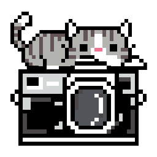

<div align="center">
  
  <h1>OhMyFlow</h1>
  <p><strong>AI photo culler for Windows. Pick your best shots 10x faster, 100% offline.</strong></p>
  <p>
    
    
    
    
    
  </p>
</div>

---

## About

OhMyFlow is a Windows desktop app that **culls thousands of photos from a shoot in minutes**. Point it at a folder and it sorts everything into three buckets:

| Bucket | Meaning |
|--------|---------|
| 🟢 **Picks** | The best shots: sharp, well exposed, solid composition |
| 🟡 **Maybe** | Borderline shots that deserve a quick human glance |
| 🔴 **Rejects** | Failures: blurry shots, closed eyes, crushed blacks, burst duplicates, blank frames |

Results export as **XMP sidecar files** (Rating 5/3/1 plus Green/Yellow/Red labels), so they show up directly in **Adobe Lightroom, Bridge, and Camera Raw** with no extra steps. Your originals are never moved, modified, or deleted. Only `.xmp` files are written next to them.

All of the AI runs **on your own machine** using ONNX Runtime plus classic computer vision heuristics. No photo ever leaves your computer. No API keys, no cloud, no subscription.

## Features

- **Three auto-culling modes** - Fast (first pass), Balance (daily driver), High (final, most thorough selection), each with a live time estimate.
- **Automatic content detection** - photos of people are judged with face and eye logic, while smooth object shots (product, ceramics, food) are judged on exposure, composition, and color with no false "closed eyes" verdicts.
- **Multi-signal scoring** - focus sharpness (Laplacian plus subject sharpness plus edge density), exposure and highlight/shadow clipping, white balance, framing and composition, perceptual-hash duplicates, and eye state.
- **A reason for every photo** - each decision ships with a short explanation in Indonesian and English (for example *"Blurry / out of focus"* or *"Duplicate / burst"*).
- **RAW+JPG pairing** - pairs like `IMG_1234.CR3` + `IMG_1234.JPG` are treated as one photo with one shared rating.
- **Move culled files** - move Picks (optionally including Maybe) into a fresh folder. RAW+JPG pairs and `.xmp` files come along, and name collisions get numbered automatically.
- **Lightbox review** - click any photo for a full-resolution preview with keyboard navigation (arrow keys to move, 1/2/3 to rate, Esc to close).
- **Lazy thumbnails with disk cache** - folders with thousands of photos stay light and fast.
- **Bilingual UI** - Indonesian and English.

## How It Works

1. **Pick a folder** - from local disk or straight off a memory card.
2. **Pick a mode** - Fast, Balance, or High (each shows an estimate for your photo count).
3. **Start culling** - the AI works locally, with live progress you can cancel anytime.
4. **Review** - filter by Picks, Maybe, or Rejects and correct anything with one click or in the lightbox.
5. **Export** - write XMP for Lightroom, and optionally move your Picks into a new folder.

## Installation and Running

### Requirements

- Windows 10/11, 64-bit
- [Node.js](https://nodejs.org/) 24 or newer (only needed to build from source)
- An NVIDIA GPU is optional (used automatically when present; CPU works fine)

### Run the release build (no tools needed)

Download `OhMyFlow.exe` from the [Releases](../../releases) page and run it directly. It is portable and needs no installation.

### Build from source

```bash
git clone https://github.com/0xMinomus/OhMyFlow.git
cd OhMyFlow
npm install

# development mode with hot reload
npm run dev

# build the Windows app (lands in release/)
npm run pack
```

| Command | What it does |
|---------|--------------|
| `npm run dev` | Vite dev server plus Electron with hot reload |
| `npm run build` | Type-check and build the renderer and main process |
| `npm run pack` | Full build plus packaging into `release/OhMyFlow-win32-x64/OhMyFlow.exe` |
| `npm start` | Run the built output in `dist/` without packaging |

> Tip: for a quick end-to-end tour after `npm run dev`, point the app at the `test-photos/` folder (sample images included in this repo).

## Supported File Formats

| Category | Extensions |
|----------|-----------|
| Standard | `.jpg` `.jpeg` `.png` `.tiff` `.tif` `.webp` `.bmp` |
| Apple | `.heic` `.heif` |
| RAW | `.cr2` `.cr3` `.nef` `.arw` `.raf` `.dng` `.rw2` `.orf` `.pef` |

RAW files without an embedded JPEG preview are still processed and clearly marked. Their ratings are written to XMP like any other photo.

## Project Structure

```
OhMyFlow/
├── electron/            # Main process: IPC, folder scan, thumbnails, XMP, file mover
│   ├── main.ts
│   └── preload.ts       # Secure renderer-to-main bridge (contextBridge)
├── src/
│   ├── components/      # UI: folder picker, modes, grid, lightbox, modal, header
│   ├── lib/ai-engine/   # Culling engine: blur, aesthetic, composition,
│   │                    #   duplicate, face, culler (orchestration plus per-mode presets)
│   ├── lib/thumbCache.ts
│   ├── store/           # App state
│   └── types/
├── public/logo.png      # App logo
├── build/               # icon.ico plus Windows packaging assets
└── test-photos/         # Sample photos for a quick trial run
```

## Privacy and Safety

- **Fully offline** - photo processing makes zero network requests. The app itself never needs the internet.
- **No API keys, no cloud** - every model and heuristic runs on local CPU/GPU.
- **Non-destructive** - culling and XMP export never modify, move, or delete original photos. (The *Move files* action is explicit: it always shows the destination and file count first, and numbers duplicate names automatically.)

## Roadmap

- [ ] Next-level blink detection (lash-line modeling) for wedding candids
- [ ] Full RAW preview decoding (embedded JPEG extraction)
- [ ] SQLite database for correction history and taste learning
- [ ] Auto-update via electron-updater
- [ ] NSIS installer plus code signing

## Contributing

Contributions are welcome. Fork the repo, create a feature branch (`git checkout -b feature/my-feature`), commit with a clear message, and open a pull request. For changes to culling behavior, please include before/after benchmark numbers on a test folder so the change can be reviewed objectively.

## License

OhMyFlow is open source software licensed under the [MIT License](LICENSE).

You are free to use, copy, modify, merge, publish, distribute, sublicense, and sell copies of the software, including for commercial purposes, as long as the original copyright notice and license text are included with any substantial portion of it.

Copyright (c) 2026 0xMinomus. See [LICENSE](LICENSE) for the full legal text.
